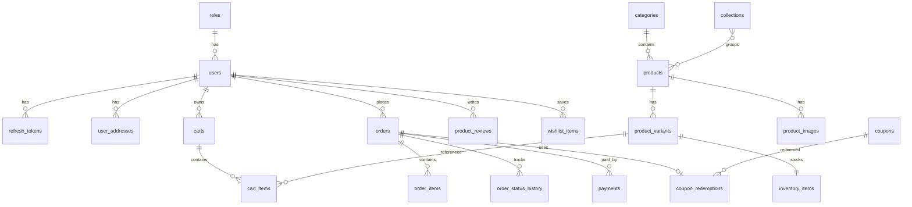

# Database Schema — Rahil Gallery

PostgreSQL schema for the jewelry e-commerce platform. Tables are grouped by **bounded context** (DDD). Application layers map as:

| Layer | Location |
|-------|----------|
| Domain entities | `internal/domain/{context}/` |
| Persistence | `internal/infrastructure/persistence/` (to be implemented) |
| Migrations | `migrations/` |

## Bounded Contexts



### Identity
- `roles`, `users`, `refresh_tokens`, `user_addresses`
- Default roles seeded: `customer`, `admin`, `staff`

### Catalog
- `categories` (self-referencing tree)
- `collections`, `product_collections`
- `products` — jewelry fields: `jewelry_type`, `metal_type`, `karat`, `gemstone_type`, `weight_grams`, `purity_percent`, `certificate_number`, `is_handmade`
- `product_variants` — size/color SKUs with `price_adjustment`
- `product_images`

### Inventory
- `inventory_items` — one row per variant; `reserved_quantity` for checkout holds

### Cart
- `carts` — authenticated (`user_id`) or guest (`guest_token`)
- `cart_items` — price snapshot at add-to-cart time

### Order
- `orders`, `order_items` (denormalized product snapshot), `order_status_history`

### Payment
- `payments` — Iranian gateways: `zarinpal`, `idpay`

### Promotion
- `coupons`, `coupon_redemptions`

### Review & Wishlist
- `product_reviews`, `wishlist_items`

## Running Migrations

Uses the `migrate/migrate` Docker image (no local `migrate` CLI needed):

```bash
make docker-dev
make migrate-up
make migrate-create NAME=add_something
```

## Design Notes

1. **UUID primary keys** — safe for distributed IDs and public APIs.
2. **Order line snapshots** — `order_items` store names/SKU/metal at purchase time so catalog edits do not change history.
3. **Soft delete** — `users` and `products` use `deleted_at`.
4. **Currency default** — `IRR`; change per deployment via env/config when wiring repositories.
5. **Guest carts** — `guest_token` on `carts` until login merge (application logic).
