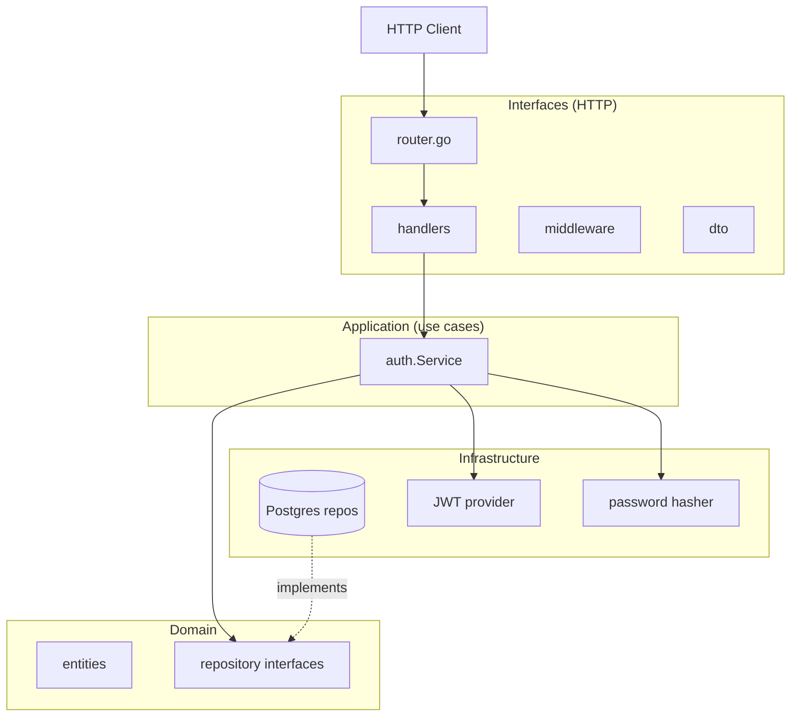
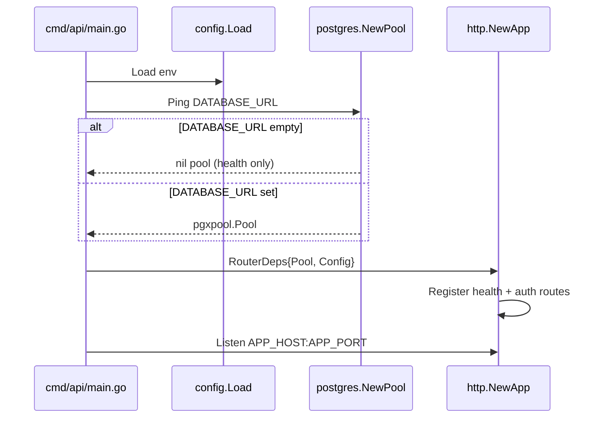
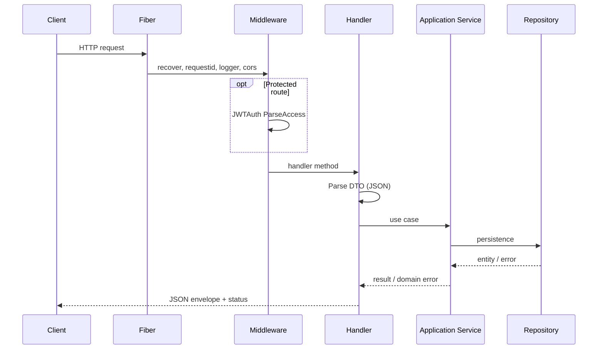
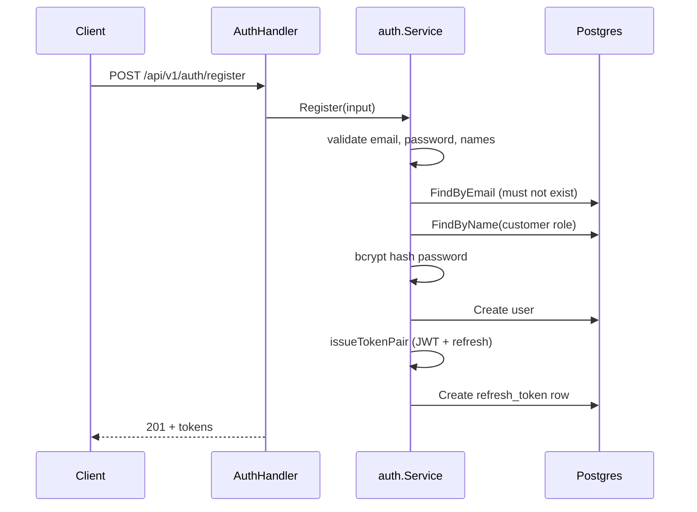
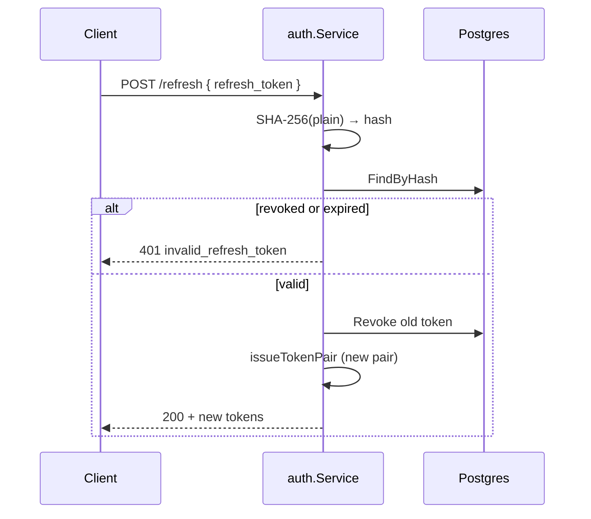
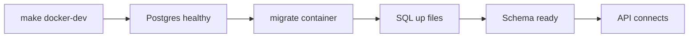
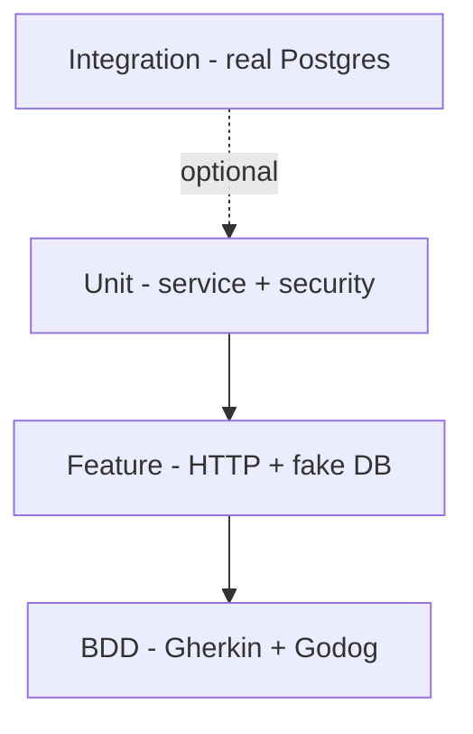
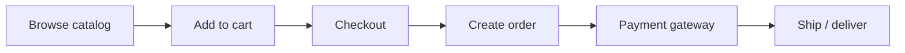

# Rahil Gallery Server — Technical Workflow Documentation

Jewelry e-commerce REST API built with **Go 1.22**, **Fiber v2**, **PostgreSQL**, and **DDD / Clean Architecture**.

---

## Table of contents

1. [System overview](#1-system-overview)
2. [Architecture](#2-architecture)
3. [Project structure](#3-project-structure)
4. [Configuration](#4-configuration)
5. [Runtime workflow](#5-runtime-workflow)
6. [Authentication workflow](#6-authentication-workflow)
7. [Database workflow](#7-database-workflow)
8. [Docker workflow](#8-docker-workflow)
9. [Development workflow](#9-development-workflow)
10. [Testing workflow](#10-testing-workflow)
11. [API reference](#11-api-reference)
12. [Domain model & bounded contexts](#12-domain-model--bounded-contexts)
13. [Error handling & responses](#13-error-handling--responses)
14. [Security](#14-security)
15. [Roadmap](#15-roadmap)

---

## 1. System overview

| Item | Value |
|------|--------|
| Module | `github.com/rahil-gallery/rahil-gallery-server` |
| HTTP framework | [Fiber](https://gofiber.io/) |
| Database | PostgreSQL 16 |
| Auth | JWT access tokens + opaque refresh tokens (DB-backed) |
| Default currency | IRR |
| API prefix | `/api/v1` |

**Current implementation status**

| Area | Status |
|------|--------|
| Schema & migrations | Done |
| Domain entities & repository ports | Done |
| Auth (register, login, refresh, logout, me) | Done |
| Postgres repos (identity only) | Done |
| Admin customers CRM API | Done — see [admin-customers-api.md](./admin-customers-api.md) |
| Catalog / cart / order APIs | Planned (ports defined) |
| Payment gateway integration | Planned |

---

## 2. Architecture

The codebase follows **Clean Architecture** with **DDD bounded contexts**. Dependencies point inward: interfaces → application → domain; infrastructure implements domain ports.



### Layer responsibilities

| Layer | Path | Responsibility |
|-------|------|----------------|
| **Domain** | `internal/domain/{context}/` | Entities, value types, repository **interfaces**, domain errors |
| **Application** | `internal/application/{context}/` | Use cases, orchestration, business rules |
| **Infrastructure** | `internal/infrastructure/` | Postgres, JWT, bcrypt, external APIs |
| **Interfaces** | `internal/interfaces/http/` | Fiber routes, handlers, DTOs, middleware |
| **Composition root** | `cmd/api/main.go` | Load config, connect DB, start server |

### Shared packages

| Package | Purpose |
|---------|---------|
| `internal/pkg/tokens` | `AccessClaims`, `TokenProvider`, `PasswordHasher`, refresh token hashing (avoids import cycles) |
| `internal/config` | Environment-based configuration |

---

## 3. Project structure

```
rahil-gallery-server/
├── cmd/api/main.go              # Entry point
├── internal/
│   ├── config/                  # APP_*, DATABASE_URL, JWT_*
│   ├── domain/                  # Per bounded context
│   │   ├── identity/
│   │   ├── catalog/
│   │   ├── cart/
│   │   ├── order/
│   │   ├── payment/
│   │   ├── promotion/
│   │   ├── inventory/
│   │   ├── review/
│   │   ├── wishlist/
│   │   └── shared/
│   ├── application/
│   │   └── auth/                # Auth use cases
│   ├── infrastructure/
│   │   ├── persistence/postgres/
│   │   └── security/            # JWT, bcrypt
│   ├── interfaces/http/
│   │   ├── handler/
│   │   ├── middleware/
│   │   ├── dto/
│   │   └── response/
│   └── pkg/tokens/
├── migrations/                  # SQL up/down
├── features/auth/               # Gherkin BDD specs
├── tests/
│   ├── bdd/                     # Godog step definitions
│   ├── feature/                 # HTTP feature tests
│   └── integration/             # Real Postgres (build tag)
├── docker-compose.yml
├── Dockerfile
├── Makefile
└── docs/
```

---

## 4. Configuration

Environment variables (see `.env.example`):

| Variable | Default | Description |
|----------|---------|-------------|
| `APP_ENV` | `development` | Environment name |
| `APP_HOST` | `0.0.0.0` | Bind host |
| `APP_PORT` | `8080` | Bind port |
| `DATABASE_URL` | — | Postgres connection string |
| `JWT_ACCESS_SECRET` | dev fallback | HS256 signing secret (**required in production**) |
| `JWT_ACCESS_TTL` | `15m` | Access token lifetime |
| `JWT_REFRESH_TTL` | `168h` | Refresh token lifetime |

**Docker vs local DB host**

| Run mode | `DATABASE_URL` host |
|----------|---------------------|
| API on host, DB in Docker | `localhost` |
| API in Docker Compose | `db` (service name) |

---

## 5. Runtime workflow

### 5.1 Application startup



1. `config.Load()` reads environment.
2. If `DATABASE_URL` is set, `postgres.NewPool` connects and pings; otherwise the API starts without DB (auth routes not registered).
3. `http.NewApp` mounts middleware (recover, request ID, logger, CORS), health checks, and auth routes when pool is non-nil.
4. Graceful shutdown on `SIGINT` / `SIGTERM` (10s timeout).

### 5.2 HTTP request flow



### 5.3 Response envelope

All auth handlers use `internal/interfaces/http/response`:

```json
{
  "success": true,
  "data": { }
}
```

```json
{
  "success": false,
  "error": {
    "code": "validation_error",
    "message": "invalid input"
  }
}
```

---

## 6. Authentication workflow

### 6.1 Components

| Component | Location |
|-----------|----------|
| Use case | `internal/application/auth/service.go` |
| JWT (access) | `internal/infrastructure/security/jwt.go` |
| Passwords | `internal/infrastructure/security/password.go` (bcrypt cost 12) |
| Refresh token storage | `refresh_tokens` table (SHA-256 hash of plain token) |
| HTTP wiring | `internal/interfaces/http/auth_wire.go` |
| JWT middleware | `internal/interfaces/http/middleware/auth.go` |

### 6.2 Register



**Validation rules**

- Email normalized (trim, lowercase).
- Password: min 8 chars, at least one letter and one digit.
- First and last name required.

### 6.3 Login

1. Find user by email (active only, not soft-deleted).
2. Compare password with bcrypt.
3. Load role by `user.role_id`.
4. Update `last_login_at`.
5. Issue new access + refresh token pair.

### 6.4 Refresh (rotation)



Each successful refresh **revokes** the previous refresh token and issues a new one.

### 6.5 Logout

1. Hash plain refresh token.
2. Find row in `refresh_tokens`.
3. Set `revoked_at` (idempotent if already missing).

### 6.6 Protected route (`GET /auth/me`)

1. `Authorization: Bearer <access_jwt>`.
2. Middleware `JWTAuth` parses and validates JWT.
3. Sets Fiber locals: `userID`, `email`, `role`.
4. Handler loads user + role, returns profile (no password).

### 6.7 JWT access token claims

| Claim | Source |
|-------|--------|
| `sub` | User UUID |
| `email` | User email |
| `role` | Role name (e.g. `customer`) |
| `exp` / `iat` | From `JWT_ACCESS_TTL` |

---

## 7. Database workflow

### 7.1 Schema

Single initial migration: `migrations/000001_init_schema.up.sql`.

Bounded contexts: **identity**, **catalog**, **inventory**, **cart**, **order**, **payment**, **promotion**, **review**, **wishlist**.

Details and ER diagram: [database-schema.md](./database-schema.md).

### 7.2 Migrations (Makefile + Docker)

No local `migrate` CLI required.

| Command | Action |
|---------|--------|
| `make docker-dev` | Start Postgres + run migrations once |
| `make migrate-up` | Apply pending migrations (`db` hostname) |
| `make migrate-down` | Roll back one version |
| `make migrate-create NAME=foo` | Create `000002_foo.up/down.sql` |
| `make migrate-up-local` | Migrate against `localhost:5432` |



### 7.3 Identity persistence (implemented)

| Repository | File |
|------------|------|
| `UserRepository` | `postgres/identity/user_repository.go` |
| `RoleRepository` | `postgres/identity/role_repository.go` |
| `RefreshTokenRepository` | `postgres/identity/refresh_token_repository.go` |

Other contexts: repository **interfaces** in domain; Postgres implementations **not yet written**.

---

## 8. Docker workflow

### 8.1 Services (`docker-compose.yml`)

| Service | Image / build | Role |
|---------|---------------|------|
| `db` | `postgres:16-alpine` | Database, port 5432 |
| `migrate` | `migrate/migrate` | One-shot schema apply |
| `api` | `Dockerfile` | Fiber API, port 8080 |

Startup order: `db` (healthy) → `migrate` (success) → `api`.

### 8.2 Common commands

```bash
cp .env.example .env
make docker-up          # Full stack
make docker-down        # Stop containers
make docker-logs        # API logs
make docker-dev         # DB + migrate only (API via go run)
```

### 8.3 Build notes (VPN / proxy)

If `go mod download` returns `403` from `proxy.golang.org`:

```bash
GOPROXY=https://goproxy.io,direct docker compose build api
# or
make docker-vendor && make docker-up-vendor
```

### 8.4 Health checks

| Endpoint | Scope |
|----------|--------|
| `GET /health` | Process liveness |
| `GET /health/ready` | Postgres ping |

---

## 9. Development workflow

### 9.1 Prerequisites

- Go 1.22+
- Docker & Docker Compose (recommended for Postgres)
- `make`, `curl` (optional)

### 9.2 Recommended local loop

```bash
# 1. Clone & env
cp .env.example .env

# 2. Database
make docker-dev
make migrate-up          # if not already applied by docker-dev

# 3. Run API on host (fast iteration)
go mod tidy
go run ./cmd/api

# 4. Fetch local catalog images (served at /static/catalog)
make fetch-catalog-images

# 5. Seed dev data (staff, customers, catalog, orders)
make seed

# 6. Verify
curl http://localhost:8080/health/ready
curl -X POST http://localhost:8080/api/v1/auth/login \
  -H 'Content-Type: application/json' \
  -d '{"email":"admin@rehil.gallery","password":"Admin1234"}'
```

**Seed credentials** (development only): `admin@rehil.gallery` / `Admin1234`, `staff@rehil.gallery` / `Staff1234`, `customer@rehil.gallery` / `Customer12`.

**Seed scale:** default 10,000 customers (`SEED_CUSTOMERS=10000 make seed`) and 100 products (`SEED_PRODUCTS=100`). Customers: 8–100,000; products: 3–10,000. Fast fixture-only: `make seed-small`. Bulk customers use `+98900…` phones; bulk products use `RG-SEED-…` SKUs for efficient reset.

### 9.3 Adding a new feature (Clean Architecture checklist)

1. **Domain** — entity + `repository.go` interface in `internal/domain/{context}/`.
2. **Migration** — `make migrate-create NAME=...`, edit SQL.
3. **Infrastructure** — `postgres/{context}/..._repository.go` implementing the port.
4. **Application** — `service.go` use cases, depend on ports + `pkg/tokens` if needed.
5. **Interfaces** — DTOs, handler, register routes in `router.go` or `auth_wire.go` pattern.
6. **Tests** — unit (`*_test.go`), feature (`tests/feature/`), BDD (`features/`) if user-facing.

### 9.4 Dependency rules

- Domain **must not** import application, infrastructure, or interfaces.
- Application **must not** import Fiber or pgx directly.
- Infrastructure implements domain ports; may import `pkg/tokens`, not `application/auth` (cycle prevention).

---

## 10. Testing workflow

Full guide: [testing.md](./testing.md).

### 10.1 Test pyramid



| Layer | Command | What it validates |
|-------|---------|-----------------|
| **TDD / Unit** | `make test-unit` | `auth.Service`, JWT, bcrypt, refresh hashing |
| **Feature** | `make test-feature` | Full HTTP auth flow with in-memory fakes |
| **BDD** | `make test-bdd` | Gherkin scenarios in `features/auth/` |
| **Integration** | `make test-integration` | Auth against real DB (`TEST_DATABASE_URL`) |
| **All** | `make test` | Everything above |

### 10.2 Test doubles

`internal/test/fakeidentity/` — in-memory `UserRepo`, `RoleRepo`, `RefreshRepo` for fast HTTP tests without Postgres.

`internal/test/testauth/` — builds a minimal Fiber app with fake repos for BDD and feature tests.

---

## 11. API reference

Base URL: `http://localhost:8080` (default).

### 11.1 Health

| Method | Path | Auth | Status |
|--------|------|------|--------|
| GET | `/health` | — | 200 |
| GET | `/health/ready` | — | 200 if DB up, 503 otherwise |

### 11.2 API info

| Method | Path | Auth |
|--------|------|------|
| GET | `/api/v1/` | — |

### 11.3 Auth

| Method | Path | Auth | Success | Body |
|--------|------|------|---------|------|
| POST | `/api/v1/auth/register` | — | 201 | `email`, `password`, `first_name`, `last_name`, optional `phone` |
| POST | `/api/v1/auth/login` | — | 200 | `email`, `password` |
| POST | `/api/v1/auth/refresh` | — | 200 | `refresh_token` |
| POST | `/api/v1/auth/logout` | — | 200 | `refresh_token` |
| GET | `/api/v1/auth/me` | Bearer JWT | 200 | — |

**Auth success `data` shape (register/login/refresh)**

```json
{
  "access_token": "...",
  "refresh_token": "...",
  "token_type": "Bearer",
  "expires_in": 900,
  "refresh_expires_in": 604800
}
```

**`GET /auth/me` `data` shape**

```json
{
  "id": "uuid",
  "email": "user@example.com",
  "first_name": "Ali",
  "last_name": "Rahil",
  "role": "customer",
  "status": "active"
}
```

### 11.4 Auth error codes (HTTP layer)

| HTTP | `error.code` | When |
|------|----------------|------|
| 400 | `validation_error` | Invalid input |
| 400 | `invalid_json` | Malformed body |
| 401 | `invalid_credentials` | Wrong email/password |
| 401 | `invalid_refresh_token` | Bad/expired/revoked refresh |
| 401 | `unauthorized` | Missing/invalid JWT |
| 403 | `inactive_account` | User not active |
| 403 | `password_not_set` | OTP-only account; password not configured |
| 409 | `email_exists` | Duplicate registration |
| 500 | `internal_error` | Unexpected failure |

### 11.4 Admin customers

Full reference: **[admin-customers-api.md](./admin-customers-api.md)**

| Method | Path | Auth | Success |
|--------|------|------|---------|
| GET | `/api/v1/admin/customers` | Bearer (`admin`/`staff`) | 200 paginated list |
| POST | `/api/v1/admin/customers` | Bearer (`admin`/`staff`) | 201 detail |
| GET | `/api/v1/admin/customers/:id` | Bearer (`admin`/`staff`) | 200 detail |
| PATCH | `/api/v1/admin/customers/:id` | Bearer (`admin`/`staff`) | 200 detail |
| DELETE | `/api/v1/admin/customers/:id` | Bearer (`admin`/`staff`) | 200 `{ "success": true }` |
| POST | `/api/v1/admin/customers/:id/block` | Bearer (`admin`/`staff`) | 200 detail |
| POST | `/api/v1/admin/customers/:id/unblock` | Bearer (`admin`/`staff`) | 200 detail |
| POST | `/api/v1/admin/customers/:id/vip` | Bearer (`admin`/`staff`) | 200 detail |
| POST | `/api/v1/admin/customers/:id/tags` | Bearer (`admin`/`staff`) | 200 detail |
| POST | `/api/v1/admin/customers/:id/notes` | Bearer (`admin`/`staff`) | 200 detail |
| GET | `/api/v1/admin/customers/segments` | Bearer (`admin`/`staff`) | 200 segment counts + saved |
| GET/POST/PATCH/DELETE | `/api/v1/admin/customers/saved-views` | Bearer (`admin`/`staff`) | Saved filter presets |

Admin customer responses use `{ "data", "meta" }` for lists and flat JSON for detail — not the auth `{ "success", "data" }` envelope.

---

## 12. Domain model & bounded contexts

### 12.1 Identity (implemented)

- **Entities:** `User`, `Role`, `RefreshToken`, `UserAddress`
- **Roles (seeded):** `customer`, `admin`, `staff`
- **User statuses:** `active`, `inactive`, `banned`
- **CRM tables:** `customer_profiles`, `customer_notes`, `customer_audit_log` (see [admin-customers-api.md](./admin-customers-api.md))

### 12.2 Catalog (implemented)

Full references: **[catalog-api.md](./catalog-api.md)** (public), **[admin-products-api.md](./admin-products-api.md)** (admin).

Jewelry-specific product fields:

- `jewelry_type` — ring, necklace, bracelet, etc.
- `metal_type`, `karat`, `gemstone_type`
- `weight_grams`, `purity_percent`, `certificate_number`
- Variants with `size_label`, `color_label`, `price_adjustment`

### 12.3 Commerce flow (planned)



| Context | Responsibility |
|---------|----------------|
| **Inventory** | Stock, reservations at checkout |
| **Cart** | Guest + authenticated carts, price snapshots |
| **Order** | Order lines with denormalized jewelry snapshot |
| **Payment** | Zarinpal / IDPay / manual |
| **Promotion** | Coupons |
| **Review** | Product reviews (moderated) |
| **Wishlist** | Saved variants per user |

---

## 13. Error handling & responses

### Domain errors (`internal/domain/shared/errors.go`)

| Error | Meaning |
|-------|---------|
| `ErrNotFound` | Entity missing |
| `ErrConflict` | Duplicate / constraint |
| `ErrInvalidInput` | Validation failed |
| `ErrUnauthorized` | Auth required |
| `ErrForbidden` | Not allowed |
| `ErrInsufficientStock` | Inventory (future) |

### Application auth errors

| Error | Maps to HTTP |
|-------|----------------|
| `ErrInvalidCredentials` | 401 |
| `ErrEmailAlreadyExists` | 409 |
| `ErrInactiveAccount` | 403 |
| `ErrInvalidRefreshToken` | 401 |

Handlers translate errors in `mapAuthError`; never return password hashes or stack traces to clients.

---

## 14. Security

| Topic | Implementation |
|-------|----------------|
| Password storage | bcrypt (cost 12) |
| Access token | HS256 JWT, short TTL |
| Refresh token | Random 32 bytes; only SHA-256 hash in DB |
| Refresh rotation | Old token revoked on refresh |
| Logout | Revokes refresh token server-side |
| Production | Set strong `JWT_ACCESS_SECRET`; use HTTPS |
| SQL | Parameterized queries via pgx |

---

## 15. Roadmap

Suggested implementation order:

1. Catalog Postgres repos + list/detail product APIs (public).
2. Admin routes with `staff` / `admin` role middleware.
3. Cart + inventory reservation use cases.
4. Checkout → order creation + payment adapter (Zarinpal/IDPay).
5. Reviews, wishlist, coupons.
6. Observability (structured logging, metrics, tracing).

---

## Related documents

| Document | Description |
|----------|-------------|
| [README.md](../README.md) | Quick start |
| [admin-customers-api.md](./admin-customers-api.md) | Admin CRM customers API |
| [database-schema.md](./database-schema.md) | ER diagram & tables |
| [testing.md](./testing.md) | Test commands & layout |
| [.env.example](../.env.example) | Environment template |
